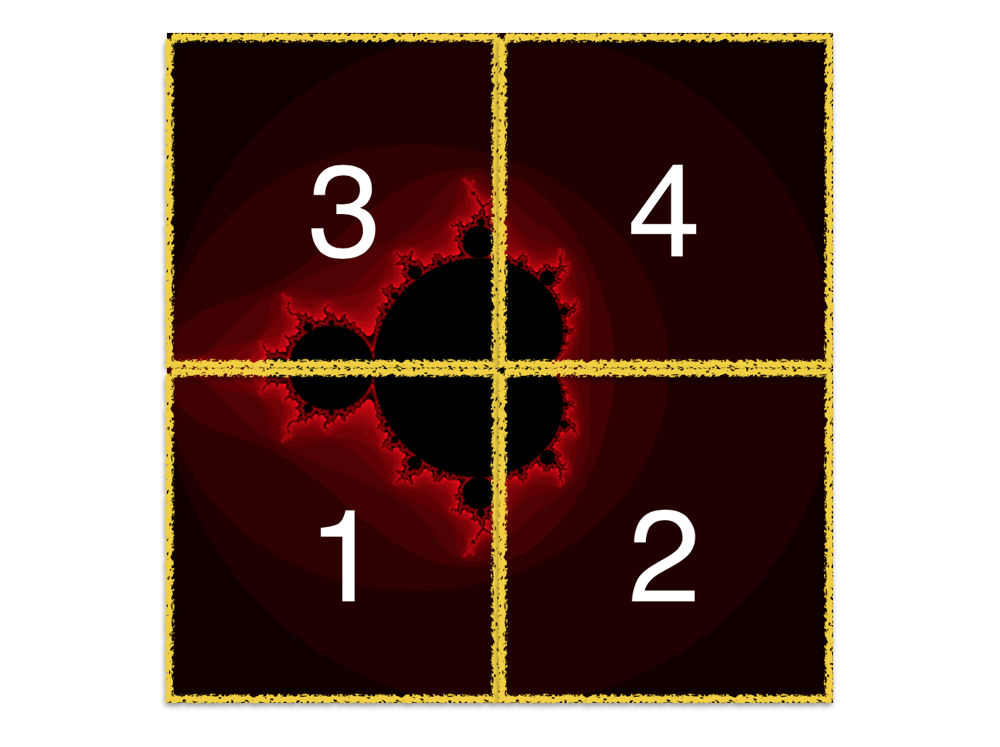

# PP_Hw2 - Mandelbrot Set
Given the range and number of points, output the png file of Mandelbrot Set.

## MPI Static version
In load balancing the term of static means predefined the job you need to do without any communication. My static strategy is if my rank = (id%size) then do the job. This strategy is easy implemented and has good performance due to the feature of Mandelbrot Set.  
考慮以下的圖，若只是單純簡單的 range partition job 給 worker 就會導致 2, 4 的工作量非常少，相反的上述的策略能夠使每個人的工作量較平均的分開而達到不錯的效能。
  

## MPI Hybrid version
In the hybrid version, each node can have multiple threads. So my strategy is using master/slave method to do load balancing. I use OpenMP to get high throughput in each slave.    
值得一提的是在 master node 中只有一個 thread 負責溝通的動作，其餘的 thread 則組成另一個 slave 一起加入工作以達到優化的目的。然而由於 OpenMP 本身並沒有這麼彈性的指令， 像是 omp 的 single, for, barrier 指令等都是會 barrier 所有 thread，並不能指定只要等待部分的 thread，因此要自己寫 barrier function，這邊利用 count 去計算是否所有 thread 都到同樣的區域。為了防止再達到 thread 個數後 需要做 reset count 的動作，因此採用取餘數的方式避免這問題。 
<b> count = (count)%(numThread) + 1 </b>    
除此外，用 thread based 寫 OpenMP 時還要注意 compiler 自動幫我們優化這件事情。有時候 compiler 為了優化的目的會自動幫我們將明明是 shared variable local 化 ，因此要記得像是在 while 迴圈內持續讀取某變數時要使  omp flush 指令去強制 synchronize 變數以獲得正確的值。
